# Tarefas #

## Task 1

Fizemos login na conta Alice com os respetivos parâmetros presentes na tabela de login no guião. De seguida, entramos na página de edição de perfil e adicionamos o seguinten o campo de brief description:

O resultado foi:

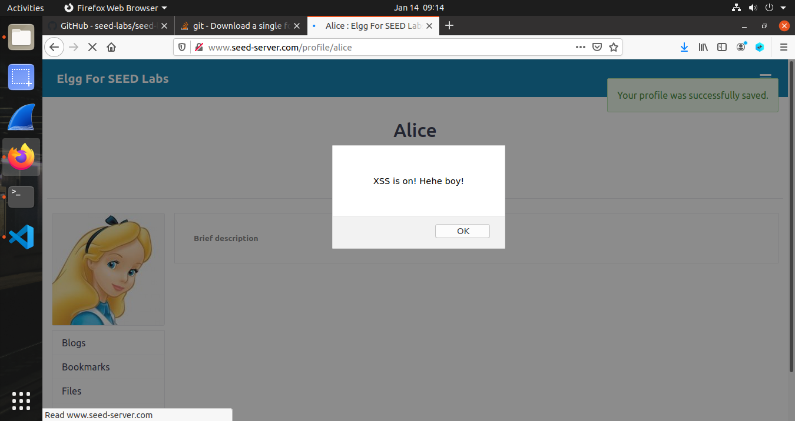

## Task 2

Repetiu-se o processo da Task 1, mas agora imprimindo os cookies do utilizador. Foi bastante semelhante à Tarefa 1, com os seguintes resultados:

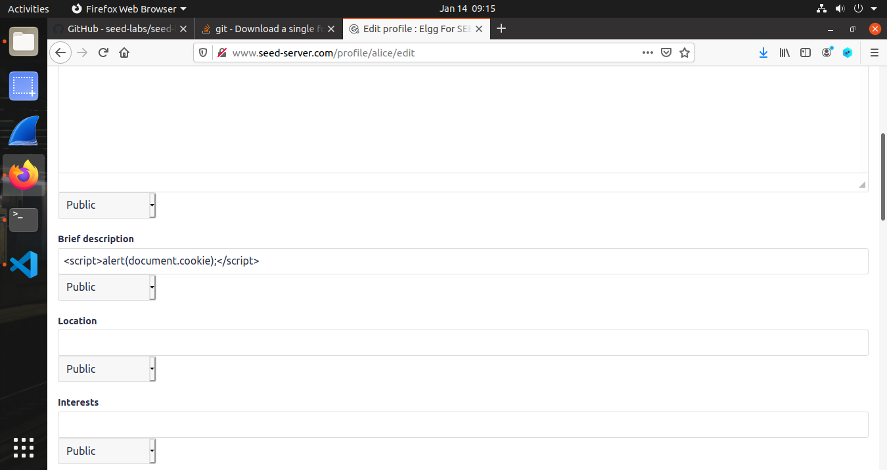

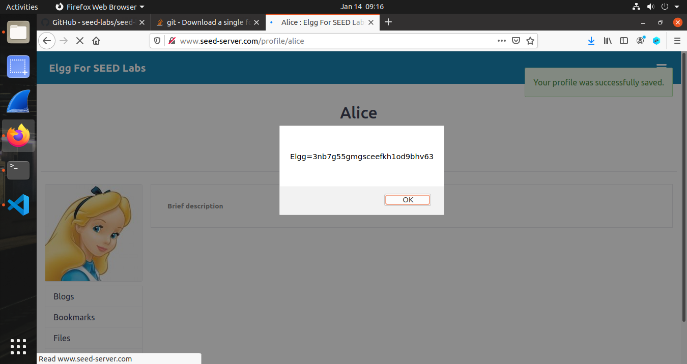

## Task 3

De acordo com o guião, iniciamos um TCP listener no port 5555 e procedemos à criação de um script no mesmo campo de brief description, que carregasse uma imagem com o campo src que conectasse com um host no port 5555. No corpo do GET request, colocamos os cookies do utilizador. Tal como era esperado, constatamos que o listener recebeu estes dados e disponibilizou os cookies "noutra máquina".

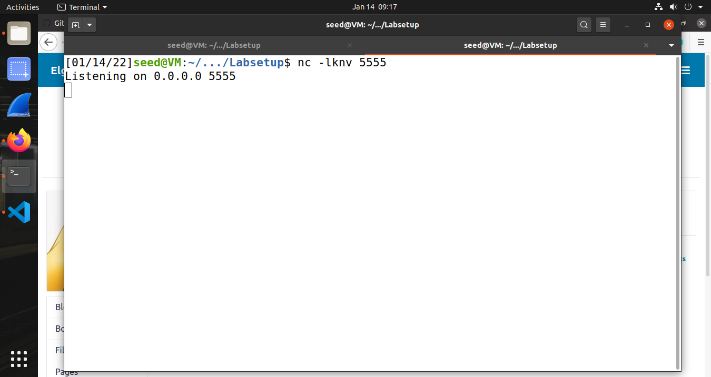

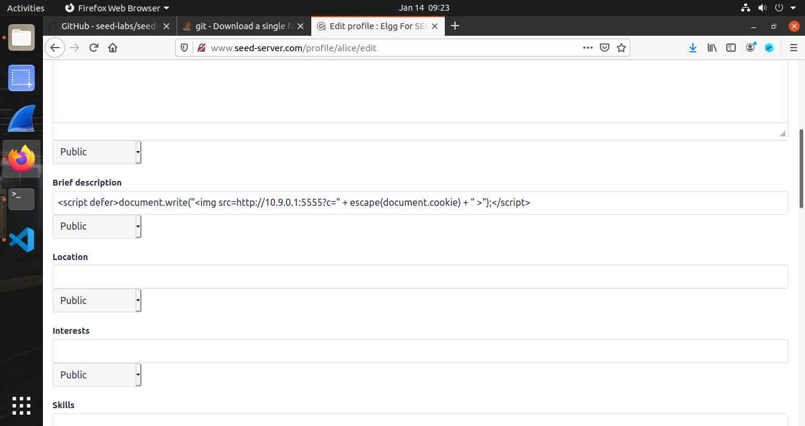

## Task 4

Inicialmente fizemos login em outra conta e tentamos adicionar a Alice. Utilizamos um visualizador de HTTP Request Headers e verificamos o seguinte:

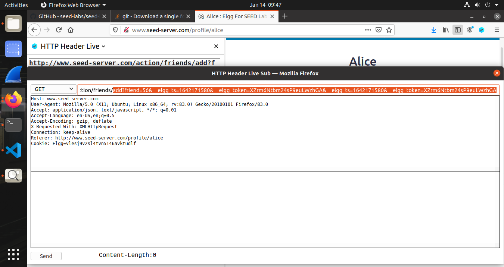

Constatamos que o ID da alice era o ID 46 (e que este mudava com outros utilizadores). Constantamos também seria necessária adicionar no request o timestamp e o respetivo token (CSRF). Assim, construimos um script igual ao seguinte:

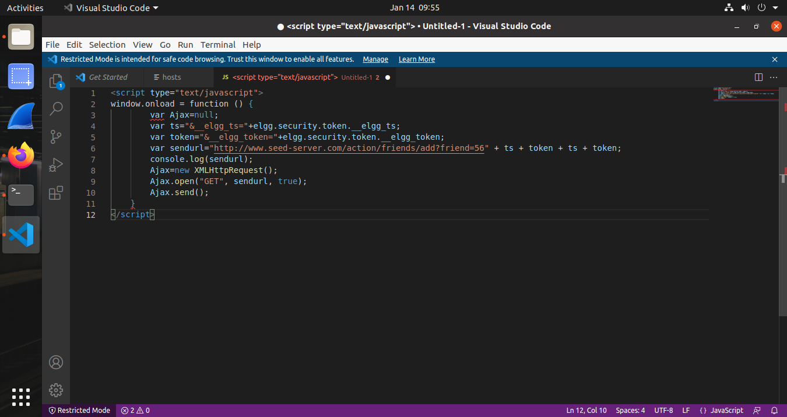

Este script foi adicionado ao campo brief description como nas tasks anteriores. Retiramos os comentários do script-template no guião, pois devido ao campo ser inline, o primeiro comentário comentaria o resto do código. O resultado no final, foi a capacidade em fazer a Alice tornar-se amiga de si mesma. O que não é esperado no funcionamento normal do website:

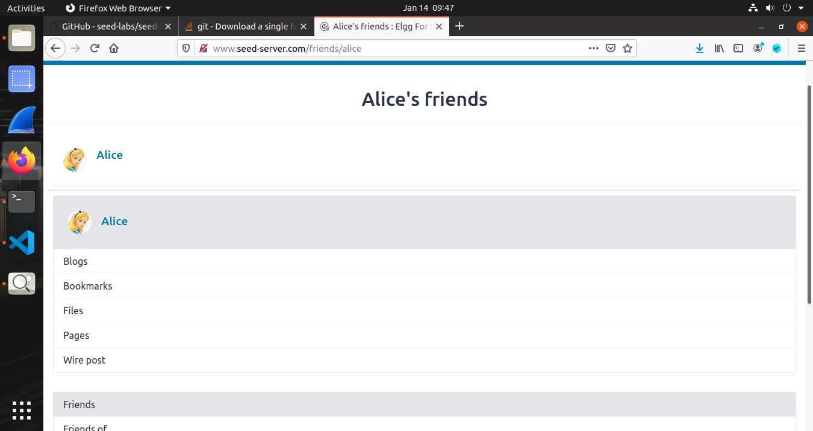

Respondendo às questões colocadas:

**Questão 1:** As linhas ➀ e ➁ no template script do guião permitem a obtenção dos dados especificos a serem enviados e provávelmente recebidos do lado do servidor (e confirmados). O ts refere à timestamp e o token certamente se refere ao CSRF token, que é único por utilizador, e que depois é confirmado pelo servidor.

**Questão 2:** Seria impossível, dado que os characters especiais são codificados, renderizando qualquer tentativa de XSS numa tentativa estéril. Por exemplo, '<' tornar-se-ia &lt, o que é essencial para criar um script. Existem, todavia, outros métodos de correção: O que seria do StackOverflow se bloqueasse todos os characters especiais ... ? 

# CTF #

## Desafio 1
Para resolver este desafio apenas precisavamos de descobrir como fazer com que o admin carregasse no botão de "give flag" em vez do "mark as read" (botão que carrega por default).

Isto é facilmente feito submetendo no formulário de submissão do pedido, submetendo um simples código javascript que força o admin a carregar no botão que queremos.

Como podemos ver com este input:

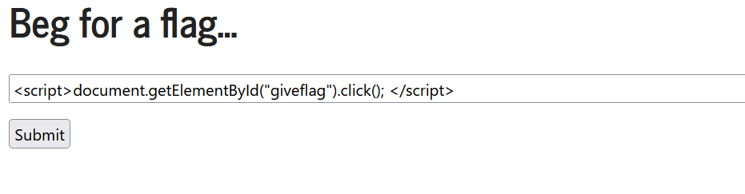

Quando o admin tentar processar o input, o javascript irá clickar no botão que queremos e assim iremos receber a flag:

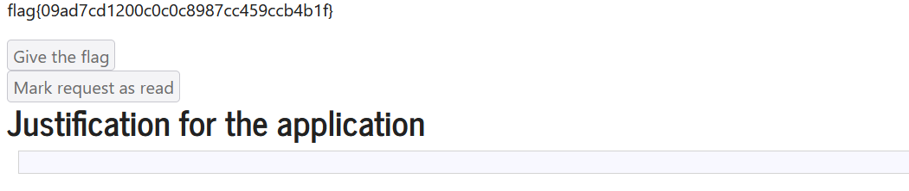

## Desafio 2
Neste desafio precisamos de encontrar uma vulnerabilidade no código que nos permita ler a flag que se encontra noutro ficheiro. A vulnerabilidade está na chamada ao gets() para um buffer de 100 bytes que não é segura o que nos permite um ataque por buffer overflow.

Assim precisamos de criar uma payload que nos permita abrir uma shell para ler o conteudo do ficheiro que contem a flag. A payload terá então o shell code, 'dummy bytes' para encher o buffer (neste caso \x11) e o endereço do buffer:

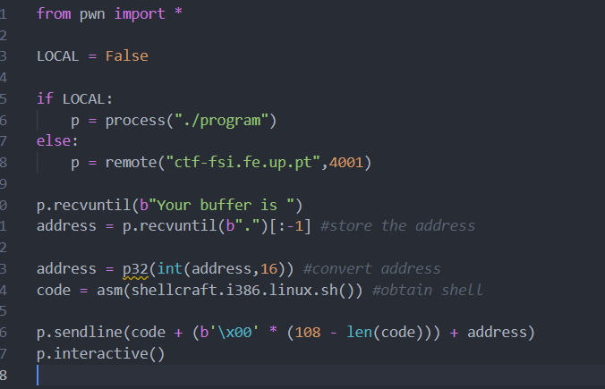

Correndo o exploit podemos então usar o comando cat para ler a flag
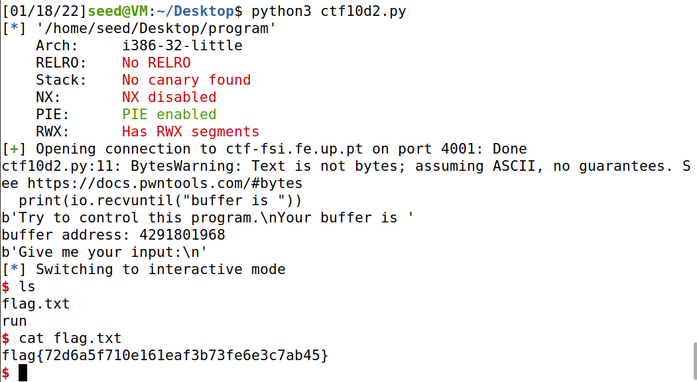

