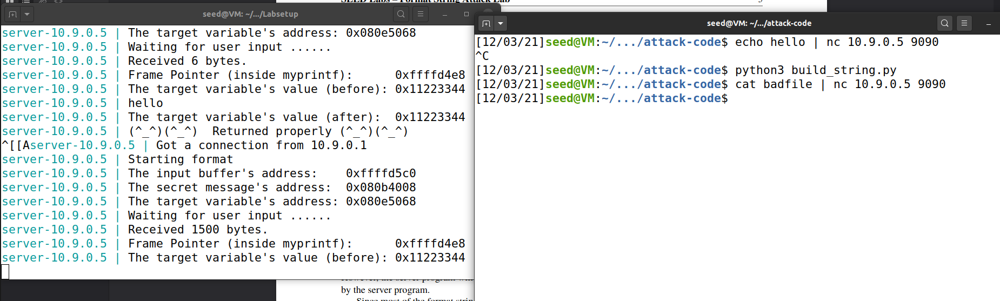
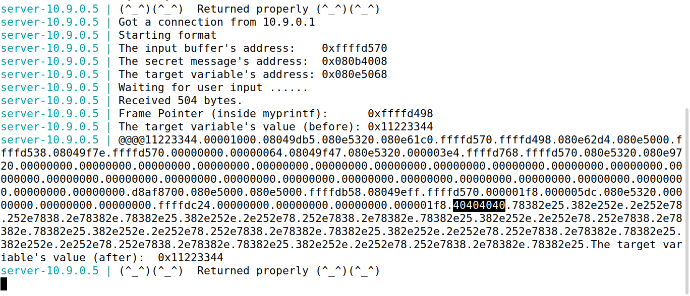
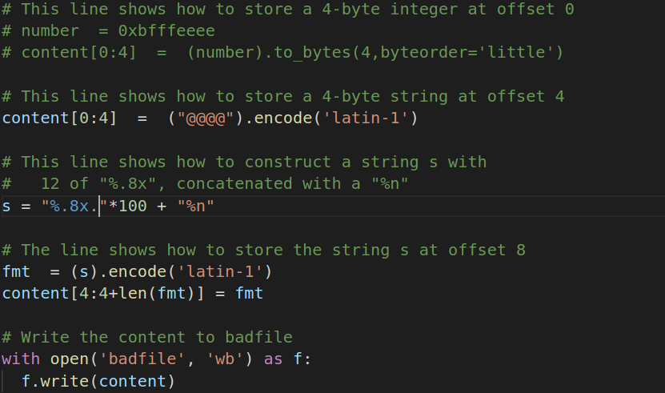
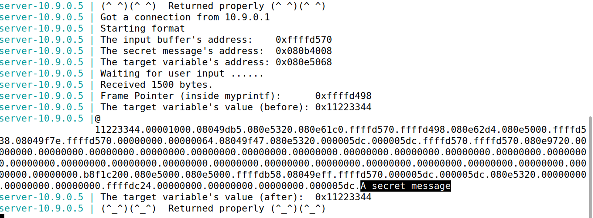
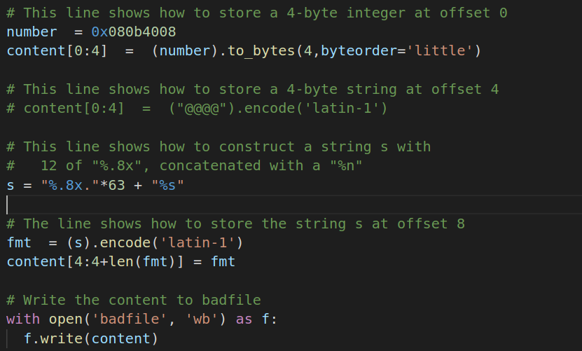
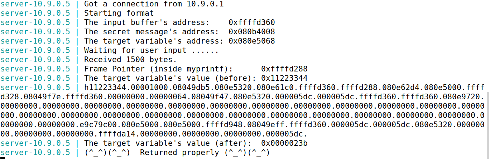
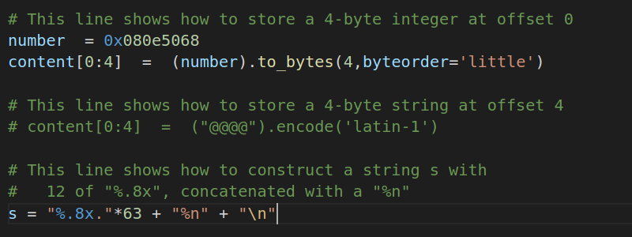
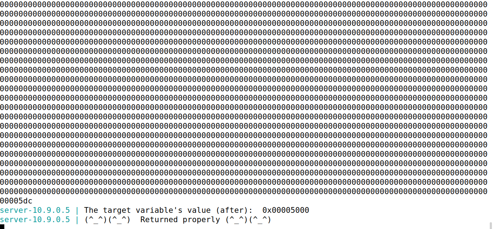
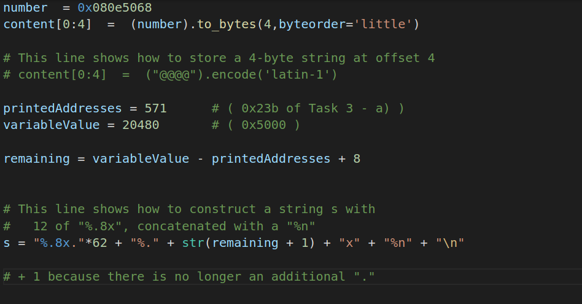

# Tarabalho semanal #

## Tarefa 1
Como tarefa inicial tinhamos então que crashar o servidor usando com "format string". Para tal apenas precisamos de dar como input ao servidor um string com multiplos '%s' que faz com que o valor obtido seja interpretado como um endereço. Quando esta string chega ao printf, é provavel que este vá tentar imprimir algo de um endereço que não tem acesso e por isso crasha como se pode ver na seguinte imagem (não observamos o as linhas com 'target value after' nem de 'returned properly'):

## Tarefa 2

### Alínea a):
Nesta tarefa temos que usar o format string para imprimir o valor de variaveis na stack. 

Para isto apenas precisamos de fornecer uma string com uns caracteres cujos valores são faceis de identificar em hexadecimal '%.8x'. Fornecemos então '@@@@' (hexadecimal 40404040) seguidos de multiplos '%.x' para imprimir os vários endereços e valores.
Analisando o output do programa verificamos que a uma distancia de 64 posições encontramos o valor da de '@@@@' o que indica que é necessário 64 'format specifiers' (%x) para imprimir os 4 bytes do nosso input.

### Alínea b):

Reutilizamos o resultado da alínea a) para obter um valor específico da heap. Para tal, sabendo que a string se situa a 64 posições acima do ponto inicial da `va_list`. Assim, para o efeito, colocamos no início o endereço da heap. Assim, quando a va_list chegar ao format specifier %s como leitura da 64ª posição, será impresso o valor dentro desta, que será o da variável.

## Tarefa 3

### Alínea a):

Seguimos o mesmo paradigma da tarefa anterior, mas agora em vez de ler os primeiros 4 bytes e utilizar tal como endereço, utilizamos o %n que guarda o número de caracteres impressos até ao momento em que foi encontrado o %n. Para tal, utilizamos as 64 posições anteriores e no início da string colocamos o endereço da variável 'target':

Podemos ver que o valor final da variável target foi 0x23b. O segmento de código Python utilizado para criar o payload foi:

### Alínea b):

Foi utilizado o mesmo paradigma que a alínea a), no entanto, para garantir que avariável ficaria 0x5000 (2048). De forma a realizar isto teremos de garantir 3 condições:

- São impressos 2048 caracteres antes de chegarmos a %n.
- Os primeiros 4 bytes serão o endereço da variável 'target'.
- Temos de preservar os 64 endereços que são impressos até chegarmos ao endereço do payload que foi recebido pelo servidor.

Ora, para tal, reutilizamos o valor 0x23b (571) da alínea a), que indica que, o valor minimo para garantir que chegamos ao endereço do payload, será 571. Para tal, apenas adicionamos o valor restante 1477 (+1 por causa do '.' que foi impresso nos anteriores 571 caracteres), forçando assim o servidor a imprimir 1477 caracteres para mostrar o valor do endereço anterior ao payload (maioria serão 0s).

Assim, temos o resultado abaixo:

