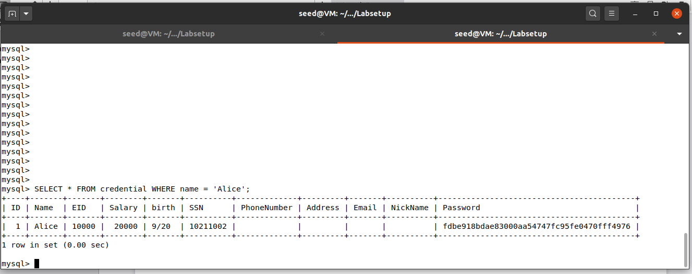
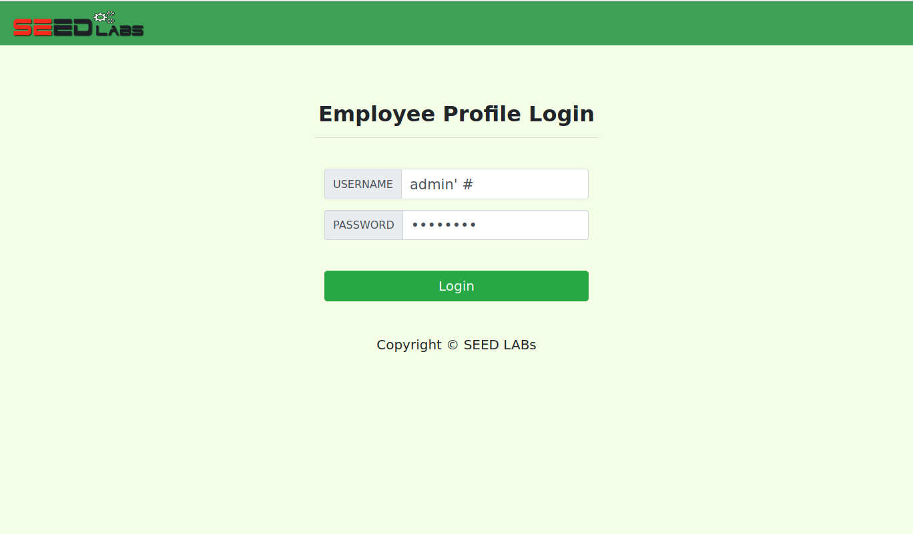
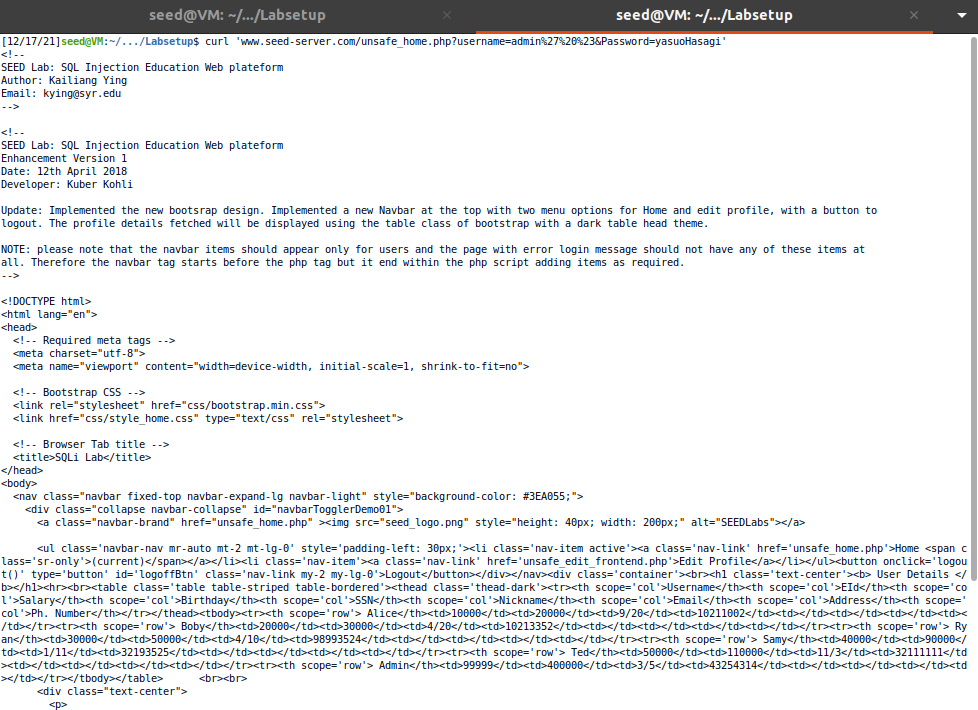
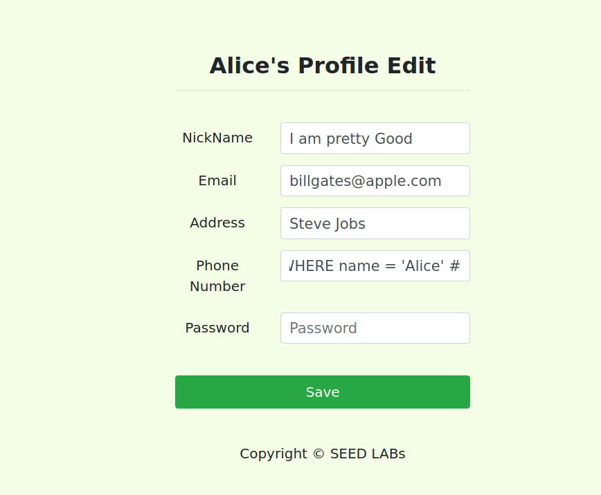
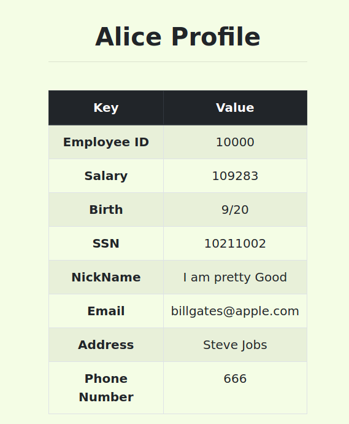
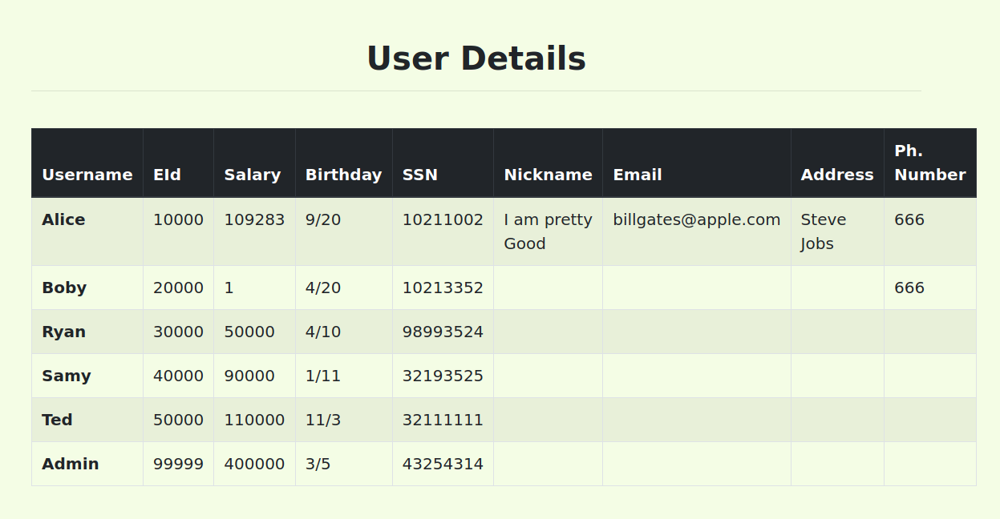
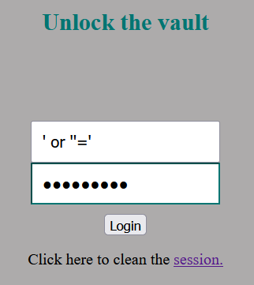
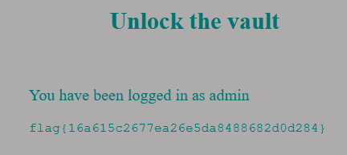
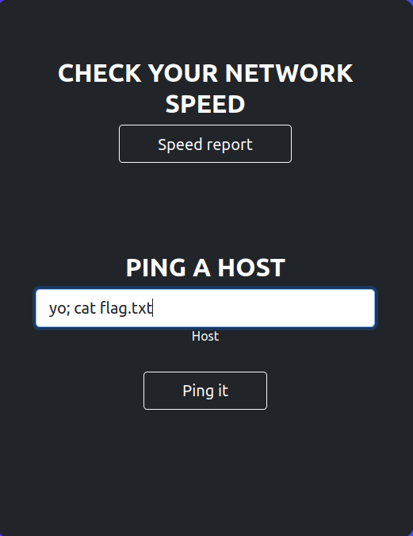
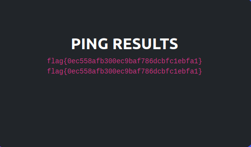

# Tarefas #

## Task 1

Realizamos um query em formato SQL, por forma a obter a informação da Alice, o processo foi o seguinte:

## Task 2

a) Para obter sucesso nesta situação, apenas colocamos um # no campo do $username, permitindo que o resto do comando SQL enviado para o mysql fosse comentado, isto assim tornaria o query realizado essentialmente num: SELECT * FROM WHERE name = 'admin'. A imagem acima representa os campos, com a password sendo qualquer valor.

b) Foi feito o mesmo que na alínea a), mas substituindo os campos por %27 ('), %20 ( ) e %23 (#) no query, essentialmente o resultado foi:

## Task 3

a) Para cumprir o requisito, apenas substituimos o campo de "phone number" (o último antes de password), para:

666' salary = 1000 WHERE name = 'alice #' (o '#' apaga os conteúdos para a frente, especificamente o 'password'). Os resultados foram:

Que levou a:

b) Seguiu-se um efeito idêntico ao da alínea anterior, mas com "bobby" no nome e os restantes campos sendo adequados aos dados já existentes no user bobby:

# CTF #

## Desafio 1

Observando o código php é evidente que podemos fazer com que a query retorne algo que nos permita fazer login através duma SQL injection

Para tal, através do seguinte input forçamos a que a query retorne os vários utilizadores, que para o 'IF' implementado no php é suficiente para logar:

E assim encontramos a primeira flag:

## Desafio 2

Para este desafio, é primeiro necessário encontrar um ponto de contact com o utilitário unix. Encontramos então uma funcionalidade que nos permite dar ping a um determinado host que provavelmente é feita por esse mesmo utilitário.

Só nos resta enviar um comando que nos permita dar o ping sem erro e, ao mesmo tempo, ler o conteudo do ficheiro que contem a flag.

Para tal um input deste género chega:

E assim obtemos a segunda flag:

